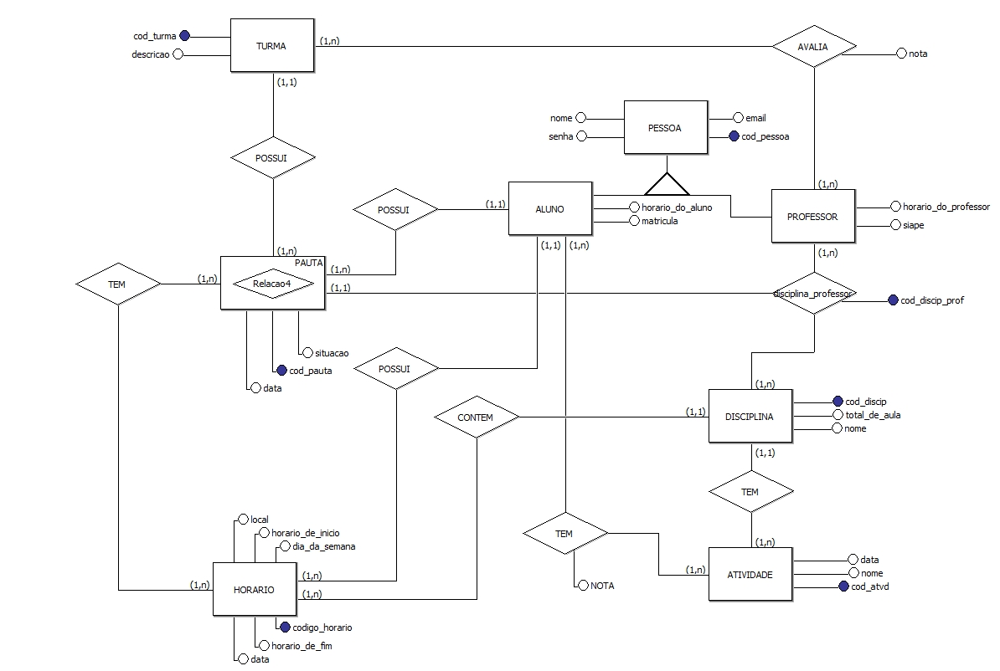
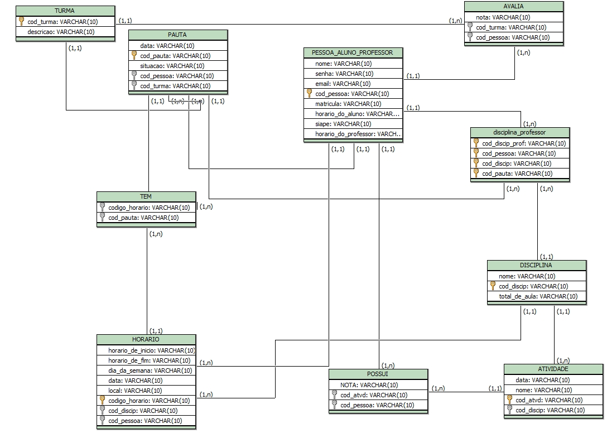

# SISTEMA DE AVALIAÇÃO ESCOLAR
Trabalho desenvolvido durante a disciplina de Banco de Dados.

# Sumário

### 1.COMPONENTES 
Thainara Amaral 
Júlio Cezar  

### 2.INTRODUÇÃO E MOTIVAÇAO 

Este documento contém a especificação do projeto do banco de dados Sistema de Avaliação Escolar e motivação da escolha realizada.  

### 3.MINI-MUNDO 
Em todo o Brasil é possível observar o ensinamento insatisfatório em salas do ensino médio. Aulas sem didáticas, que dificultam o entendimento do aluno, turmas muito cheias e, até mesmo, alunos indisciplinados prejudicam o rendimento de uma classe inteira.  
Com intuito de melhorar as aulas dessas escolas, um sistema de avaliação escolar será desenvolvido. Nesse projeto, os alunos poderão avaliar as aulas e os professores, além de, ter acesso as suas notas e frequência. Os professores também poderão realizar as avaliações dos alunos, porém, essas serão classificadas por séries e turmas. 
Além da mobilidade e facilidade de acesso a aplicação também contará com interface de pauta e atividades com notas, onde os docentes poderão se manter melhores organizados sem necessitar realizar trabalhos manuais. 
Para o primeiro acesso será necessário o cadastro do usuário, que deverá informar dados básicos como nome, matrícula, que será cedido pela escola em que se encontra matriculado, ou o siape do professor, e-mail, telefone, senha e o tipo de usuário. 
O sistema tem como principal função avaliar turmas, disciplinas e professores. Para isso será gerado relatórios que terão como base as avaliações feitas. Com isso, a escola poderá se reunir com o corpo docente e tomar novas medidas de ensino.
 

### 4.RASCUNHOS BÁSICOS DA INTERFACE (MOCKUPS) 

https://github.com/thainaraamaral/Trabalho01/blob/master/Sistema%2BEscolar.pdf  

### 5.MODELO CONCEITUAL 
  
    
    b) NOTACAO UML (Caso esteja fazendo a disciplina de analise)

#### 5.1 Validação do Modelo Conceitual
  Grupo 1: Milena Gomes e Luiza Alves  
  Grupo 2: Gabriel Novaes e Sabrina Leal  

#### 5.2 DECISÕES DE PROJETO
Disciplina_professor : A relação disciplina_professor possui um atributo identificador (cod_discip_prof) para relacionar o professor e a disciplina, ligando os dois diretamente a pauta.
 
Pauta: A pauta é um relacionamento entre relações que vira uma entidade associativa e foi utilizada pois necessitava interligar relações que geraria uma nova tabela. Na mesma conterá informações relativa a pauta, turma e disciplinas.

#### 5.3 DESCRIÇÃO DOS DADOS  

DISCIPLINA: Tabela para o armazenamento de informações sobre a disciplina. 
 
Nome: Campo que armazena o nome para cada disciplina. 
 
Total de Aulas: Campo que armazena o número total de aulas das disciplinas. 
 
Código da Disciplina: Campo que armazena o código referente a disciplina. 
 
ATIVIDADE: Tabela para o armazenamento de informações relativas as atividades. 
 
Data: Campo que armazena a data para as atividades. 
 
Nome: Campo que armazena o nome para cada atividade. 
 
Código da Atividade: Campo que armazena o código referente a atividade. 
 
TURMA: Tabela para o armazenamento de informações relativas as turmas. 
 
Descrição: Campo que armazena a descrição e o detalhamento da turma. 
 
Código da turma: Campo que armazena o código referente a turma. 
 
PESSOA: Tabela para o armazenamento de informações relativas as pessoas que compõem o sistema. 
 
E-mail: Campo que armazena os e-mails das pessoas do sistema. 
 
Nome: Campo que armazena os nomes das pessoas do sistema. 
 
Senha: Campo que armazena as senhas das pessoas do sistema. 
 
Código da Pessoa: Campo que armazena o código para diferenciação de pessoa, o código referente as pessoas. 
 
ALUNO: Tabela para o armazenamento de informações relativas aos alunos que compõem o sistema. 
 
Matricula: Campo que armazena as matriculas dos alunos. 
 
Horário: Campo que armazena os horários referentes aos alunos. 
 
PROFESSOR: Tabela para o armazenamento de informações relativas aos professores que compõem o sistema. 
 
Siape: Campo que armazena o Siape referente a cada professor. 
 
Horário: Campo que armazena os horários referentes aos professores. 
 
PAUTA: Tabela para o armazenamento de informações relativas a listagem de elementos. 
 
Código da Pauta: Campo que armazena o código referente a pauta e identifica a pauta de cada turma. 
 
Situação: Campo que armazena a frequência dos alunos. 
 
Data: Campo que armazena as datas das pautas. 
 
HORÁRIO: Tabela para o armazenamento de informações relativas aos horários e datas. 
 
Horário de Início: Campo que armazena os horários iniciais das aulas. 
 
Horário de Fim: Campo que armazena os horários ide finalização das aulas. 
 
Dia da Semana: Campo que armazena os dias da semana. 
 
Local: Campo que armazena o local das aulas. 
 
Data: Campo que armazena as datas para as aulas. 
 
Código Horário: Campo que armazena o código referente ao horário. 

### 6	MODELO LÓGICO 

### 7	MODELO FÍSICO 

https://github.com/thainaraamaral/Trabalho01/blob/master/MODELO%20F%C3%8DSICO.sql 
     
 
### 8	INSERT APLICADO NAS TABELAS DO BANCO DE DADOS 

#### 8.1 DETALHAMENTO DAS INFORMAÇÕES
        Detalhamento sobre as informações e processo de obtenção ou geração dos dados.
        Referenciar todas as fontes referentes a :
        a) obtenção dos dados
        b) obtenção de códigos reutilizados
        c) fontes de estudo par
        
#### 8.2 INCLUSÃO DO SCRIPT PARA CRIAÇÃO DE TABELA E INSERÇÃO DOS DADOS

CRIAÇÃO DE TABELA :
 
CREATE TABLE PESSOA(
COD_PESSOA INT NOT NULL,
NOME VARCHAR(45),
SENHA VARCHAR(10),
EMAIL VARCHAR (45),
PRIMARY KEY (COD_PESSOA));
   
INSERÇÃO DE DADOS NA TABELA:
 
INSERT INTO PESSOA (COD_PESSOA,NOME,SENHA,EMAIL)
VALUES (001,'ANA','IFES2017','ANA.BD@GMAIL.COM'),
(002,'BIA','IFES2017','BIA.BD@GMAIL.COM');
   
 
### 9	TABELAS E PRINCIPAIS CONSULTAS 
OBS: Incluir para cada tópico as instruções SQL + imagens (print da tela) mostrando os resultados. 
#### 9.1	CONSULTAS DAS TABELAS COM TODOS OS DADOS INSERIDOS (Todas)  

SELECT*FROM PESSOAS;    

#### 9.2	CONSULTAS DAS TABELAS COM FILTROS WHERE (Mínimo 3)  

#### 9.3	CONSULTAS QUE USAM OPERADORES LÓGICOS, ARITMÉTICOS E CAMPOS RENOMEADOS (Mínimo 2) 
#### 9.4	CONSULTAS QUE USAM OPERADORES LIKE (Mínimo 3)   
#### 9.5	ATUALIZAÇÃO E EXCLUSÃO DE DADOS (Mínimo 6) 
#### 9.6	CONSULTAS COM JUNÇÃO (Todas Junções) 
#### 9.7	CONSULTAS COM GROUP BY (Mínimo 5) 
        Entrega até este ponto em (data a ser definida)
        
#### 9.8	CONSULTAS COM LEFT E RIGHT JOIN (Mínimo 4)  
#### 9.9	CONSULTAS COM SELF JOIN (todas) E VIEW (mais importantes)  
#### 9.10	SUBCONSULTAS (Mínimo 3)  
### 10	ATUALIZAÇÃO DA DOCUMENTAÇÃO DOS SLIDES 
### 11	DIFICULDADES ENCONTRADAS PELO GRUPO 

        Entrega até este ponto em (data a ser definida)
        
### 12  FORMATACAO NO GIT: https://help.github.com/articles/basic-writing-and-formatting-syntax/
